# A Brief Derivation of Spacetime

The sign is structural. The magnitude is empirical. The bridge is tracked claim by claim.

<p align="center">
  <a href="https://github.com/rishistyping/ii-logos-spacetime-derivation/actions/workflows/lean.yml"></a>
  <a href="https://github.com/rishistyping/ii-logos-spacetime-derivation/actions/workflows/python-checks.yml"></a>
  <a href="paper/260504%20A%20Brief%20Derivation%20of%20Spacetime.pdf"></a>
  <a href="./index.html"></a>
  <a href="docs/notebooks.md"></a>
  <a href="docs/claim-status.md"></a>
  <a href="docs/proof-visuals.md"></a>
  <a href="https://ii.inc"></a>
  <a href="https://ii.inc/web/blog/post/logos"></a>
  <a href="LICENSE"></a>
</p>

<p align="center">
  
</p>
<p align="center">
  <sub>LOGOS is the public-facing presentation surface for the spacetime derivation project.</sub>
</p>
<p align="center">
  <sub><strong>Algebra can carry a sign. Physics decides how far that sign reaches.</strong></sub>
</p>

This repository is the public verification and explainer companion to *A Brief Derivation of Spacetime*. The paper asks why time has a direction that space does not, and traces the answer through a curvature sign that survives the passage from spatial geometry to de Sitter time evolution.

The repository keeps that story honest. Lean 4 supplies proof authority for the exact algebraic surface now encoded. SymPy and Wolfram provide computed companions and reader-facing artifacts. The physical arrow-of-time thesis remains labeled as interpretation until its bridges are separately formalized.

## At a Glance

- `Story path` (no setup): start with the first two sections and the public preview.
- `Formal path` (with checks): read status board + run `bash scripts/check_all.sh`.
- `Contributor path`: follow `PLANS.md` + `ops/long-horizon/` for roadmap and gates.

```
Paper -> Public Story -> Claim Boundary -> Lean + SymPy Evidence
```

## Public Navigation

- Read first: [`index.html`](./index.html) then [`docs/public-reader-preview.md`](docs/public-reader-preview.md)
- Check boundaries: [`docs/claim-status.md`](docs/claim-status.md)
- Validate tooling and checks: [`docs/build-status.md`](docs/build-status.md)
- Deep map: [`docs/proof-visuals.md`](docs/proof-visuals.md)

## Why This Matters

The usual story says that spacetime comes first and dynamics happens inside it. This paper tries a more architectural route: begin with ordinary positive space, let curvature appear as the failure of translations to commute, and ask what happens when the selected positive branch is read as spacetime.

The punchline is not that a measured physical number drops out of pure algebra. It is subtler and cleaner:

- `The algebra carries a sign.` The curvature parameter `λ` sorts the available geometries.
- `The positive spatial branch is special.` The paper argues that the finite, fully invariant spatial starting point is the positive branch.
- `The same sign enters spacetime.` After the signature change, four-dimensional symbolic Lambda satisfies `Λ = 3λ`.
- `Time evolution splits directions.` The local matrix `A(λ)` has algebraic eigendirections on the positive branch.
- `The final physical reading is guarded.` Light-cone, horizon, redshift, and arrow-of-time language remain above the current theorem surface.

## The Six-Step Story

The paper starts with the least exotic object in geometry: a positive metric. Every squared distance is positive, and no spatial direction is preferred.

Then it asks what happens to translations. In flat space, translations commute. On curved spaces they fail to commute, and the maximally symmetric possibilities are organized by one number:

```text
[P_a, P_b] = λ J_ab
```

Positive `λ` gives the spherical branch, zero `λ` gives the flat branch, and negative `λ` gives the hyperbolic branch. The paper's finiteness argument selects the positive spatial branch before time is introduced.

The time step is a signature change. The positive sphere algebra is related to the de Sitter algebra after one coordinate is read as temporal. The same `λ` now controls spacetime curvature, and in four dimensions the symbolic relation becomes:

```text
Λ = 3λ
```

The crucial local computation is a two-by-two matrix. Time evolution acts on each `(K_i, P_i)` plane by:

```text
A(λ) = [[0, -λ],
        [-1,  0]]
```

For nonnegative `λ`, Lean proves the algebraic eigendirection equations:

```text
ℓ+ = (-√λ, 1),  A(λ)ℓ+ =  √λ ℓ+
ℓ- = ( √λ, 1),  A(λ)ℓ- = -√λ ℓ-
```

v1.0 adds the split-form bridge:

```text
Q(k,p) = k² - λp²

Q(ℓ+) = 0
Q(ℓ-) = 0
Q(rv) = r²Q(v)
```

The paper then reads those algebraic directions as part of the physical arrow story. This repository tracks that final move as interpretation, not as a proved theorem.

## Explainable Visual Map

The README now follows the broader Intelligent Internet / LOGOS presentation grammar: parchment surfaces, navy structure, restrained accents, and proof-first diagrams. These images are explanatory surfaces; the Lean files remain the proof authority.

<p align="center">
  
</p>
<p align="center">
  <sub>Paper source, Lean proof authority, computed companions, visual explanation, and release checks move as one verification story.</sub>
</p>

<p align="center">
  
</p>
<p align="center">
  <sub>The bridge funnel separates Lean-proved algebra from the later physical interpretation boundary.</sub>
</p>



```mermaid
flowchart LR
    S["Positive spatial metric"] --> C["Curvature bracket"]
    C --> B["lambda branch split"]
    B --> P["positive finite branch"]
    P --> D["de Sitter signature change"]
    D --> M["time-evolution matrix"]
    M --> E["Lean-proved eigendirections"]
    E --> Q["Lean-proved split form"]
    Q --> I["physical interpretation boundary"]
    classDef default fill:#E8EDE5,stroke:#0F233F,stroke-width:1.5px,color:#0F233F;
    linkStyle default stroke:#5D6572,stroke-width:2px;
```

For the deeper public proof map, use [`docs/proof-visuals.md`](docs/proof-visuals.md). For the reader-first explainer, use [`docs/public-reader-preview.md`](docs/public-reader-preview.md).

## Quick Evidence Tour

1. Read the six-step story above and the public preview.
2. Check the status board for each claim boundary.
3. Open `results/` and `viz/` to inspect committed evidence.
4. Run one command:

```bash
uv sync && bash scripts/check_all.sh
```

5. Compare `docs/build-status.md` with `docs/claim-status.md`.

## What Is Proved Now

This is a v1.0 bridge-decomposition release. The promoted Lean surface is intentionally narrow:

| Packet | Status | What it covers |
| --- | --- | --- |
| Matrix spine | `Lean-proved` | `A(λ)`, trace, determinant, characteristic polynomial, and `A(λ)²=λI` |
| Branch markers | `Lean-proved` | positive, zero, and negative algebraic branch behavior |
| Eigendirections | `Lean-proved` | `ℓ+`, `ℓ-`, eigenvalues, nonzero witnesses, and distinctness for `λ>0` |
| Split form | `Lean-proved` | `Q(ℓ+)=0`, `Q(ℓ-)=0`, and quadratic scaling |
| Four-dimensional Lambda arithmetic | `Lean-proved` | `Λ=3λ` and positive `λ` gives positive symbolic `Λ` |

The physical interpretation remains separate:

| Packet | Status |
| --- | --- |
| Sphere compactness / finiteness bridge | `Imported theorem` |
| Wick-rotation / Lorentzian signature reading | `Interpretation` |
| Eigenspaces as geometric light-cone directions | `Interpretation` |
| Horizon, redshift, and arrow-of-time reading | `Interpretation` |
| Shared sign thesis for `t`, `c`, and `Λ` | `Interpretation` |

See [`docs/claim-status.md`](docs/claim-status.md) for the canonical claim board.

## Choose Your Path

- `General reader:` [Why This Matters](#why-this-matters) → [`docs/public-reader-preview.md`](docs/public-reader-preview.md)
- `Researcher:` [The Six-Step Story](#the-six-step-story) → [`docs/paper-lean-notebook-crosswalk.md`](docs/paper-lean-notebook-crosswalk.md) → `paper/`
- `Formal verifier:` [`docs/claim-status.md`](docs/claim-status.md) → [`docs/theorem-ledger.md`](docs/theorem-ledger.md) → `Spacetime.lean`
- `Technical explorer:` [`notebooks/spacetime_sympy_colab.ipynb`](notebooks/spacetime_sympy_colab.ipynb) + [`sympy/`](sympy/) + `results/` + `viz/`
- `Maintainer or publisher:` [`docs/repo-operating-system.md`](docs/repo-operating-system.md), [`PLANS.md`](PLANS.md), [`ops/long-horizon/`](ops/long-horizon/), and [Release Discipline](#release-discipline).

## What to do in 20 minutes

1. Read [`docs/public-reader-preview.md`](docs/public-reader-preview.md)
2. Confirm claim tags in [`docs/claim-status.md`](docs/claim-status.md)
3. Inspect one artifact file, e.g. `results/eigendirection_summary.json`
4. Check CI with `bash scripts/check_all.sh`

## Formal Verification

The repository formalizes the current exact algebraic spine in Lean 4. The development is deliberately lightweight and matrix-first: define the minimal objects, prove exact identities, and keep physical bridge claims out of proof status until they have their own theorem surface.

| Surface | Role | Authority |
| --- | --- | --- |
| [`paper/`](paper/) | Paper source, PDF, and physical narrative | Paper |
| [`Spacetime.lean`](Spacetime.lean) and [`Spacetime/`](Spacetime/) | Guarded Lean theorem surface | Lean proof authority |
| [`sympy/`](sympy/) and [`results/`](results/) | Exact computational checks and committed artifacts | `Computed here` |
| [`docs/`](docs/) and [`spec/`](spec/) | Truth surfaces, ledgers, and crosswalks | Repository governance |
| [`docs/assets/`](docs/assets/) and [`viz/`](viz/) | Visual presentation companions | Explanatory only |

The main Lean modules line up with the current theorem surface:

| Lean surface | What it covers |
| --- | --- |
| [`Spacetime/TimeEvolutionMatrix.lean`](Spacetime/TimeEvolutionMatrix.lean) | exact `A(λ)` matrix spine |
| [`Spacetime/SignVerdict.lean`](Spacetime/SignVerdict.lean) | algebraic branch markers |
| [`Spacetime/EigenDirections.lean`](Spacetime/EigenDirections.lean) | minimal `Vec2`, matrix-vector action, eigendirections |
| [`Spacetime/NullBridge.lean`](Spacetime/NullBridge.lean) | split quadratic form and algebraic split-nullness |
| [`Spacetime/SignatureBridge.lean`](Spacetime/SignatureBridge.lean) | four-dimensional Lambda arithmetic |

## Explore It for Yourself

Run the full local validation gate:

```bash
uv sync
bash scripts/check_all.sh
```

The helper runs the SymPy exact/eigendirection/bridge checks, regenerates JSON and visual artifacts, checks artifact drift, validates truth surfaces, scans Lean files for proof holes, and runs `lake build`.

If you are not using `uv`, install the core Python dependencies from `requirements.txt` and run the same helper. Lean/Lake is required for the full v1.0 validation gate.

The notebook dependency surface is optional:

```bash
uv sync --extra notebooks
```

The README visuals can be regenerated on macOS with:

```bash
docs/assets/render_readme_assets.py
```

## Build And Repository Map

```text
paper/                    Paper source and PDF
Spacetime/                Lean scaffold modules
Spacetime.lean            Guarded root
SpacetimeFull.lean        Full-paper interpretation root
sympy/                    Exact symbolic scripts and regression checks
results/                  JSON result artifacts and manifest
viz/                      Generated branch-flow figures
docs/assets/              README visual assets and renderer
wolfram/                  Notebook plan and builder stub
notebooks/                Python/SymPy notebook walkthrough
docs/                     Claim ledger, theorem ledger, crosswalks, guides
spec/                     Machine-readable claim/equation/symbol specs
scripts/                  Local reproducibility helpers
.github/workflows/        CI gates
ops/long-horizon/         Long-running build control plane
```

## Release Discipline

Before any additional exact claim is promoted, update these surfaces together:

```text
docs/claim-status.md
docs/theorem-ledger.md
docs/paper-lean-notebook-crosswalk.md
spec/claims.yaml
spec/equations.yaml
docs/build-status.md
README.md
```

The final physical sentence that `t > 0`, `c > 0`, and `Λ > 0` share the same sign remains `Interpretation` in v1.0.
