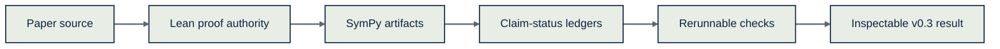

# A Brief Derivation of Spacetime

[](https://lean-lang.org/)
[](https://www.sympy.org/)
[](https://www.wolfram.com/wolfram-engine/)
[](paper/260504%20A%20Brief%20Derivation%20of%20Spacetime.pdf)
[](LICENSE)

This repository is the public verification and explainer companion to *A Brief Derivation of Spacetime*. The paper asks a simple question with a sharp edge: why does time have a direction that space does not?

The paper's answer is that the arrow was not an extra ingredient added to symmetric laws. It was a sign already present in the algebra. Start with ordinary positive space, let curvature appear as the failure of translations to commute, pass through the finite positive-curvature branch, and the same sign reappears as de Sitter time evolution, the expanding direction, and the positive cosmological constant.

<p align="center">
  <sub><strong>The sign is structural. The magnitude is empirical. The bridge is tracked claim by claim.</strong></sub>
</p>

## The Idea In Plain English

- `Curvature is failed commuting.` On a flat floor, walking east then north lands where north then east would. On a sphere, those two trips do not quite agree. That failure is curvature.
- `One sign splits three worlds.` The parameter `λ` sorts the maximally symmetric geometries into positive, zero, and negative branches.
- `The positive branch is the finite one.` The paper argues that a fully invariant normalized geometry selects the positive-curvature branch before time is introduced.
- `Time arrives by changing signature.` The sphere's algebra becomes the de Sitter algebra after one coordinate changes sign. The same `λ` now controls spacetime curvature.
- `Time evolution has two algebraic directions.` On each `(K_i, P_i)` plane, time evolution is the matrix `A(λ)`. For `λ > 0`, it has two real eigendirections, one expanding and one contracting.
- `The physical arrow remains a bridge claim.` The repository proves the exact algebraic matrix and eigendirection facts. The final reading that those eigendirections are light rays, horizons, and the observed arrow of time is tracked as `Interpretation` until separately formalized.

## The Six-Step Story

The paper begins with the least exotic object in geometry: the dot product. Ordinary space has a positive metric, so every squared distance is a sum of squares and no spatial direction is preferred.

Then it asks what happens to translations. In flat space, translations commute. On curved spaces they do not, and the maximally symmetric possibilities are classified by one number:

```text
[P_a, P_b] = λ J_ab
```

Positive `λ` gives the sphere, zero `λ` gives flat space, and negative `λ` gives hyperbolic space. The paper's finiteness argument then selects the positive branch as the self-contained spatial starting point.

The time step is a signature change. The positive sphere algebra `so(d+1)` is related to the de Sitter algebra `so(d,1)` by changing one coordinate from spatial to temporal. The same sign of `λ` survives the passage from space to spacetime, and in four dimensions the cosmological constant relation reads `Λ = 3λ`.

The crucial local computation is a two-by-two matrix. Time evolution acts on each `(K_i, P_i)` plane by

```text
A(λ) = [[0, -λ],
        [-1,  0]]
```

For positive `λ`, that matrix separates into two algebraic eigendirections:

```text
ℓ+ = (-√λ, 1),  A(λ)ℓ+ =  √λ ℓ+
ℓ- = ( √λ, 1),  A(λ)ℓ- = -√λ ℓ-
```

The paper reads the expanding direction as the future-facing sign of time. The repository keeps that last move honest: algebraic eigendirections are now Lean-proved, while the null/light-cone and horizon interpretation remains outside the proved surface.

## Explainable Map

```mermaid
flowchart LR
    S["Positive spatial metric"] --> C["Curvature bracket [P,P] = lambda J"]
    C --> B["lambda branch split"]
    B --> P["positive finite branch"]
    P --> D["de Sitter signature change"]
    D --> M["time-evolution matrix A(lambda)"]
    M --> E["Lean-proved eigendirections"]
    E --> I["physical arrow interpretation"]
    classDef default fill:#E8EDE5,stroke:#0F233F,stroke-width:1.5px,color:#0F233F;
    linkStyle default stroke:#5D6572,stroke-width:2px;
```





## Current Verification Status

This is a **v0.3 verification skeleton**. Lean is the intended proof authority for exact algebraic and matrix identities. SymPy and Wolfram are computational and explanatory companions. Physical interpretations such as the arrow of time and the shared sign of `t`, `c`, and `Λ` remain tagged as `Interpretation` until each bridge is separately formalized.

The exact matrix spine, algebraic branch markers, and positive-branch algebraic eigendirections have been promoted to `Lean-proved` after `lake build`.

The current `Lean-proved` matrix spine is:

```text
A(λ) = [[0, -λ],
        [-1,  0]]

trace(A)    = 0
det(A)      = -λ
charpoly(A) = x² - λ
A(λ)²       = λ I
```

The current branch surface is:

| Branch | Lean-proved algebraic fact | Notebook / explainer reading |
| --- | --- | --- |
| `λ > 0` | `det(A) < 0` and the hyperbolic algebraic marker holds | SymPy records real split roots; hyperbolic flow |
| `λ = 0` | `A² = 0` | parabolic / nilpotent limit |
| `λ < 0` | `det(A) > 0`, `trace(A)=0`, and the elliptic algebraic marker holds | elliptic flow |

The current `Lean-proved` eigendirection bridge is algebraic only:

```text
ℓ+ = (-√λ, 1),  A(λ)ℓ+ =  √λ ℓ+    for λ ≥ 0
ℓ- = ( √λ, 1),  A(λ)ℓ- = -√λ ℓ-    for λ ≥ 0
```

For `λ > 0`, Lean also proves `ℓ+ ≠ ℓ-`. The claim that these eigendirections are null/light-cone directions remains `Interpretation`.

## Choose your path

- `General reader:` Start with [The Idea In Plain English](#the-idea-in-plain-english), [The Six-Step Story](#the-six-step-story), and the paper PDF in [`paper/`](paper/).
- `Paper reader:` Compare the paper source in [`paper/`](paper/) with the status board in [`docs/claim-status.md`](docs/claim-status.md).
- `Formal verifier:` Start with [`Spacetime.lean`](Spacetime.lean), [`Spacetime/`](Spacetime/), and [`docs/theorem-ledger.md`](docs/theorem-ledger.md).
- `Notebook explorer:` Use [`sympy/`](sympy/), [`results/`](results/), [`viz/`](viz/), and the Colab-style notebook stub in [`notebooks/spacetime_sympy_colab.ipynb`](notebooks/spacetime_sympy_colab.ipynb).
- `Maintainer or publisher:` Use [`docs/`](docs/), [`spec/`](spec/), and [Release discipline](#release-discipline) before promoting any new claim.

## Authority model

The repository uses the same four evidence tags as the One Postulate and Cosmological Constant companion repositories:

- `Lean-proved`: only after a successful `lake build` with no proof holes.
- `Computed here`: exact symbolic/computational artifacts generated inside this repository.
- `Imported theorem`: standard outside mathematical/geometric facts accepted as external inputs.
- `Interpretation`: paper-level physical or philosophical readings above the theorem surface.

See [`docs/status-definitions.md`](docs/status-definitions.md) and [`docs/claim-status.md`](docs/claim-status.md).

## Reproduce the current checks

```bash
uv sync
bash scripts/check_all.sh
```

The combined helper runs the SymPy exact/eigendirection checks, regenerates the
JSON and visual artifacts, scans Lean files for proof holes, and runs
`lake build` when Lean/Lake is installed.

If you are not using `uv`, install the core Python dependencies from
`requirements.txt` and run the same helper.

The notebook dependency surface is optional:

```bash
uv sync --extra notebooks
```

If Lean is unavailable, the helper records that the Lean gate was skipped rather
than supporting additional theorem promotion.

## Build map

```text
paper/                    Paper source and PDF
Spacetime/                Lean scaffold modules
Spacetime.lean            Guarded root
SpacetimeFull.lean        Full-paper interpretation root
sympy/                    Exact symbolic scripts and regression checks
results/                  JSON result artifacts and manifest
viz/                      Generated branch-flow figures
wolfram/                  Notebook plan and builder stub
notebooks/                Python/SymPy notebook stub
docs/                     Claim ledger, theorem ledger, crosswalks, guides
spec/                     Machine-readable claim/equation/symbol specs
scripts/                  Local reproducibility helpers
.github/workflows/        CI skeletons
```

## Release discipline

Before any additional exact claim is promoted to `Lean-proved`, update these surfaces together:

```text
docs/claim-status.md
docs/theorem-ledger.md
docs/paper-lean-notebook-crosswalk.md
spec/claims.yaml
spec/equations.yaml
docs/build-status.md
README.md
```

The final physical sentence — that `t > 0`, `c > 0`, and `Λ > 0` share the same sign — remains `Interpretation` in v0.3.
