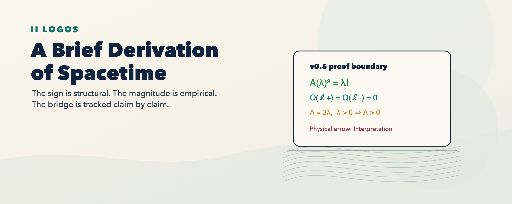
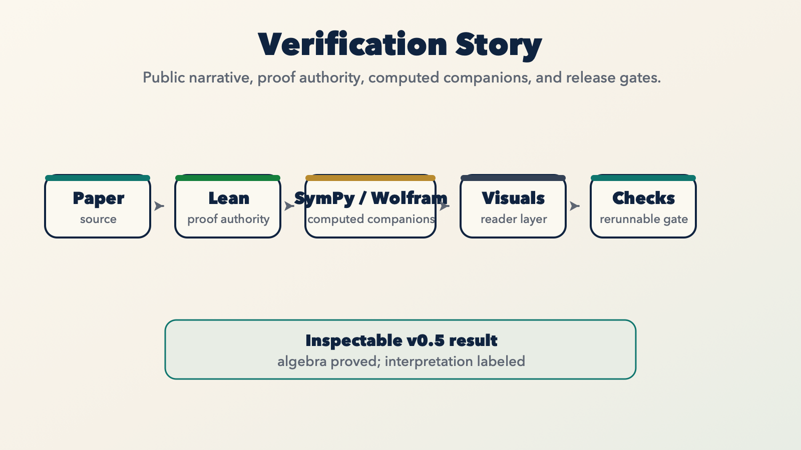
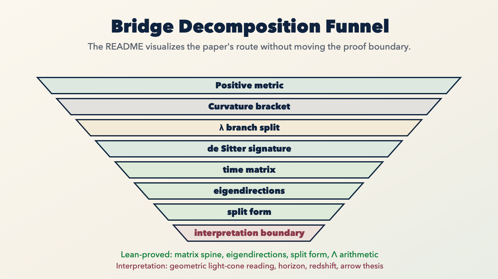

# Proof Visuals

The skeletal visual layer should compress the argument without adding proof authority.

## LOGOS README Assets

These overview maps follow the Intelligent Internet presentation grammar:
cream surfaces, navy structure, restrained accents, and proof-first editorial
hierarchy.

<p align="center">
  
</p>

<p align="center">
  
</p>

<p align="center">
  
</p>

The SVG sources and PNG renderer live in `docs/assets/`. Regenerate them with:

```bash
docs/assets/render_readme_assets.py
```

## Current assets

- `docs/public-reader-preview.md`
- `docs/assets/logos-spacetime-hero.png`
- `docs/assets/verification-story.png`
- `docs/assets/bridge-decomposition-funnel.png`
- `viz/hyperbolic_flow.png`
- `viz/parabolic_flow.png`
- `viz/elliptic_flow.png`

The `viz/` images are generated from `sympy/spacetime_visualize.py` and illustrate the three regimes of the exact matrix

```text
A(λ) = [[0, -λ], [-1, 0]].
```

The public reader preview combines those images with Mermaid diagrams and visible truth tags. It does not add proof authority.

The v0.5 computed artifact layer also includes split-null, Lambda-sign,
branch-flow, and invariant-form JSON summaries in `results/`. Those files are
audit trails for the visual narrative, not physical proof objects.

## Target v1 assets

- `wolfram/assets/notebook_hero_overview.svg`
- `wolfram/assets/notebook_preview_branches.svg`
- `wolfram/assets/notebook_preview_time_matrix.svg`
- `wolfram/assets/notebook_preview_eigenflow.svg`
- `wolfram/assets/notebook_preview_crosswalk.svg`

## Companion-friendly legend

- `v` markers above are visual navigation, not proof objects.
- `Lean-proved` appears only where a corresponding declaration exists in Lean and the repo passes `lake build`.
- `Computed here` appears where files in `sympy/` and `results/` are the source evidence.
- `Interpretation` is kept for claims beyond the current theorem authority.

## Boundary

Visuals are not proof objects. They are `Computed here` or `Interpretation` surfaces, depending on the row in `docs/claim-status.md`.
