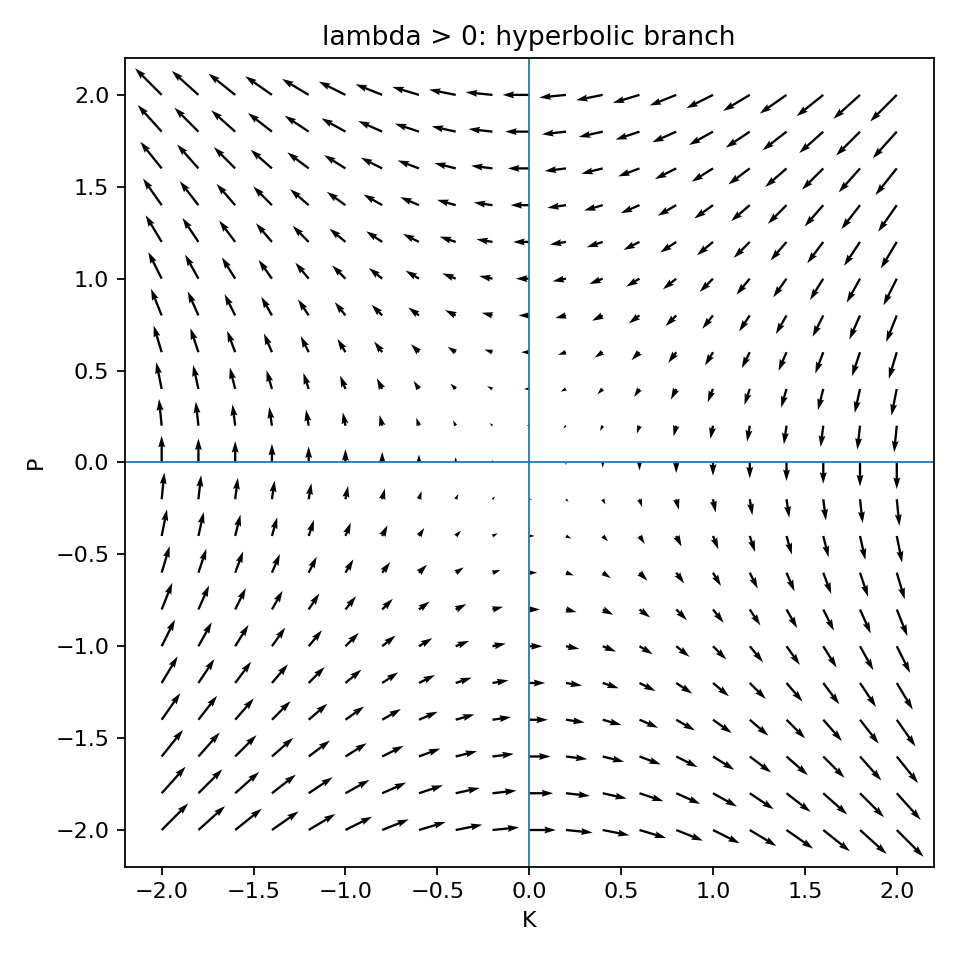
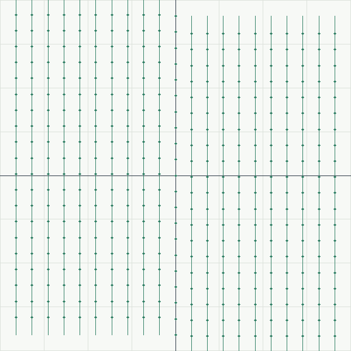
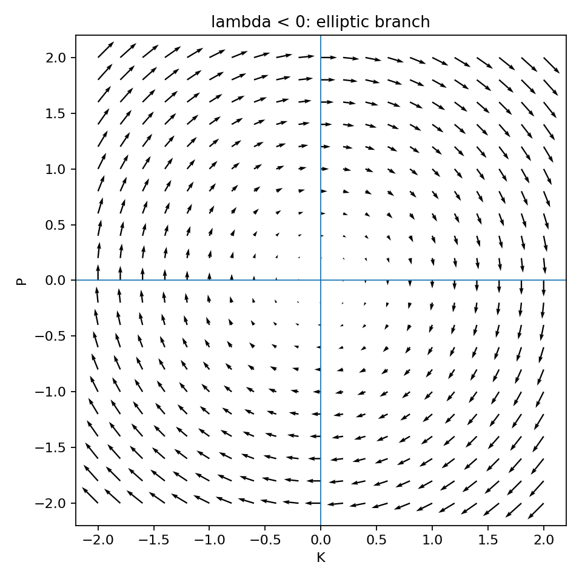
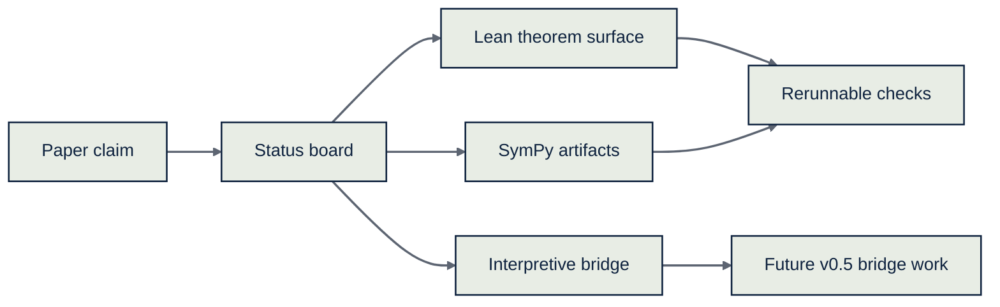

# Public Reader Preview

This page is a lightweight public guide to *A Brief Derivation of Spacetime*.
It is meant to be readable before the Lean files, while preserving the same
truth boundaries used by the repository.

## Claim Tags

| Tag | Meaning in this preview |
| --- | --- |
| `Lean-proved` | Encoded in Lean, built by `lake build`, and guarded by the proof-hole scan. |
| `Computed here` | Checked by committed SymPy scripts and result artifacts. |
| `Imported theorem` | Standard outside mathematical fact used as a bridge. |
| `Interpretation` | Paper-level physical reading above the current theorem surface. |

## The Story

The paper begins with ordinary space. A dot product makes every squared
distance positive, and no spatial direction is preferred. That opening idea is
a geometric starting point, not a Lean theorem in this repository.

`Truth tag: Interpretation`

Next comes curvature. In flat space, translations commute. On curved space,
moving in two directions in different orders can fail to land in the same
place. The paper packages that failure as

```text
[P_a, P_b] = λ J_ab
```

The sign of `λ` sorts the three maximally symmetric branches: sphere, flat
space, and hyperbolic space.

`Truth tag: Interpretation`

The finiteness step selects the positive spatial branch. The repository treats
the compactness/finiteness input as an external mathematical bridge rather
than a locally reproved Lean theorem.

`Truth tag: Imported theorem`

Then the paper changes signature. The positive sphere algebra becomes the
de Sitter algebra when one coordinate is read as time. The same `λ` now
controls spacetime curvature, with `Λ = 3λ` in four dimensions.

`Truth tag: Computed here`

The local algebraic core is the time-evolution matrix on each `(K_i, P_i)`
plane:

```text
A(λ) = [[0, -λ],
        [-1,  0]]
```

The repository proves the exact matrix definition, trace, determinant,
characteristic polynomial, and square identity in Lean.

`Truth tag: Lean-proved`

## Branch Picture

The three plots below are generated from `sympy/spacetime_visualize.py`. They
are explanatory companions, not proof objects.

| Branch | Reader picture | Truth surface |
| --- | --- | --- |
| `λ > 0` | Hyperbolic split directions | `Lean-proved` determinant/branch marker; flow image is `Computed here` |
| `λ = 0` | Parabolic limit | `Lean-proved` square-zero marker; flow image is `Computed here` |
| `λ < 0` | Elliptic rotation-like behavior | `Lean-proved` determinant/trace marker; flow image is `Computed here` |







## Eigendirections

For `λ ≥ 0`, the repository proves the algebraic eigendirection equations:

```text
ℓ+ = (-√λ, 1),  A(λ)ℓ+ =  √λ ℓ+
ℓ- = ( √λ, 1),  A(λ)ℓ- = -√λ ℓ-
```

It also proves that `ℓ+` and `ℓ-` are distinct when `λ > 0`.

`Truth tag: Lean-proved`

The paper then reads those directions as lightlike directions, horizons, and
the sign of the arrow of time. That final physical reading is not promoted in
this repository yet.

`Truth tag: Interpretation`

## Visual Map

```mermaid
flowchart LR
    A["Positive metric"] --> B["Curvature bracket"]
    B --> C["lambda branch split"]
    C --> D["positive finite branch"]
    D --> E["de Sitter signature change"]
    E --> F["time-evolution matrix"]
    F --> G["Lean-proved eigendirections"]
    G --> H["arrow-of-time interpretation"]
    classDef default fill:#E8EDE5,stroke:#0F233F,stroke-width:1.5px,color:#0F233F;
    linkStyle default stroke:#5D6572,stroke-width:2px;
```





## Boundary To Remember

The public preview is allowed to explain the paper's story, but it must not
change the proof status of any claim. As of v0.4, the repository has promoted
the exact matrix spine, branch markers, and algebraic eigendirections. It has
not promoted the null/light-cone bridge, redshift, horizon interpretation,
arrow of time, or shared-sign thesis.

For the canonical ledger, see `docs/claim-status.md`.
